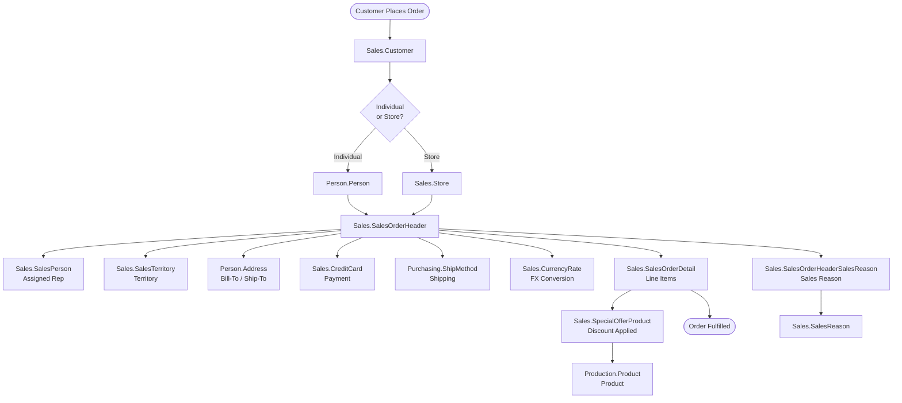
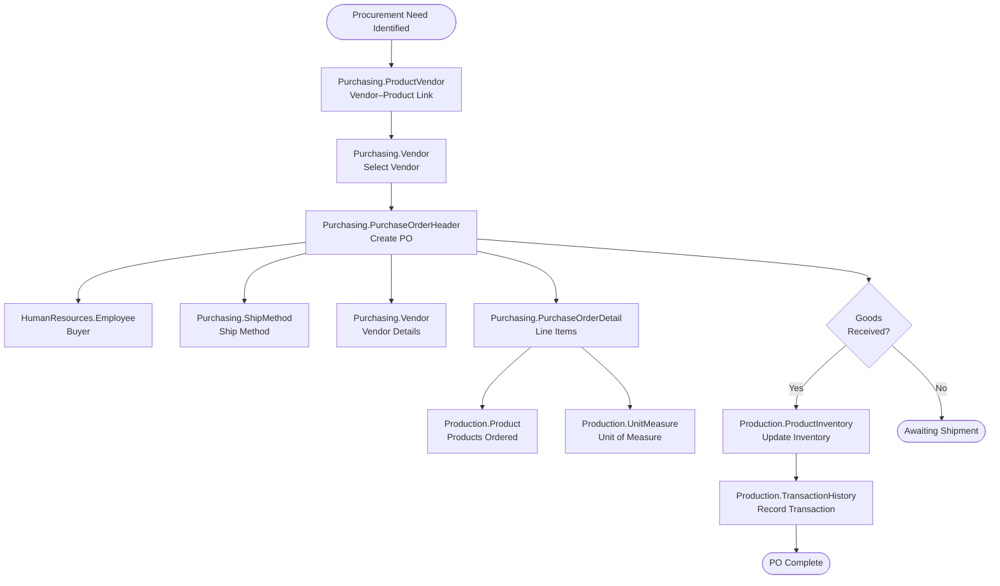
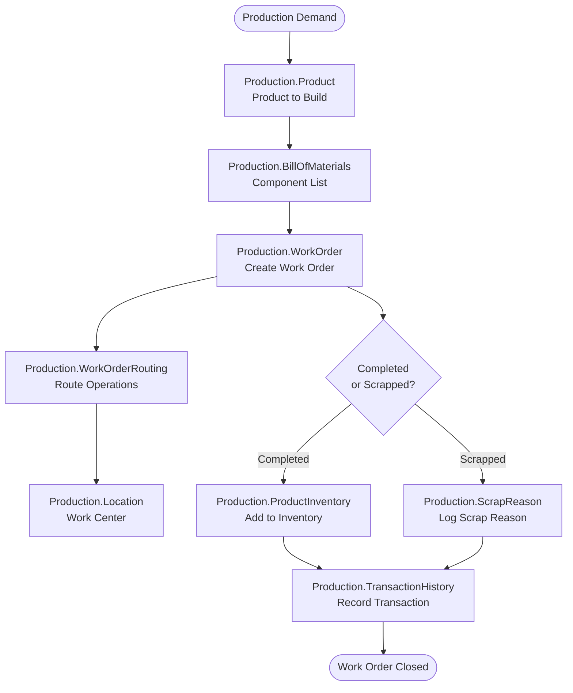
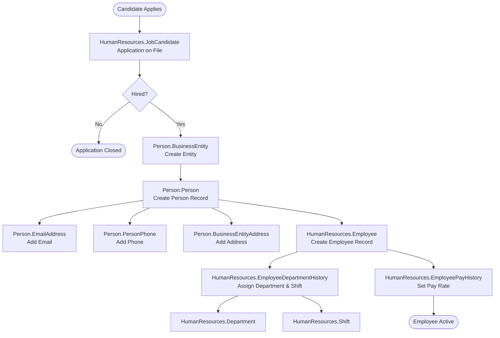
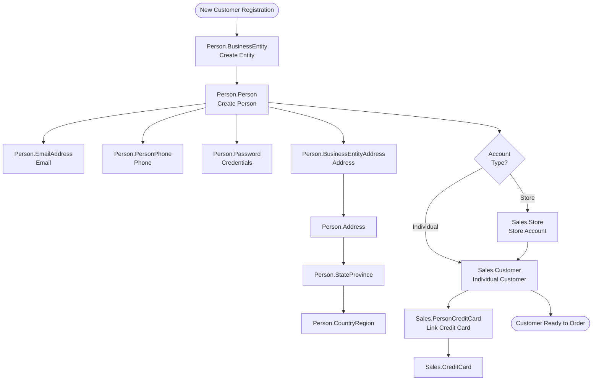
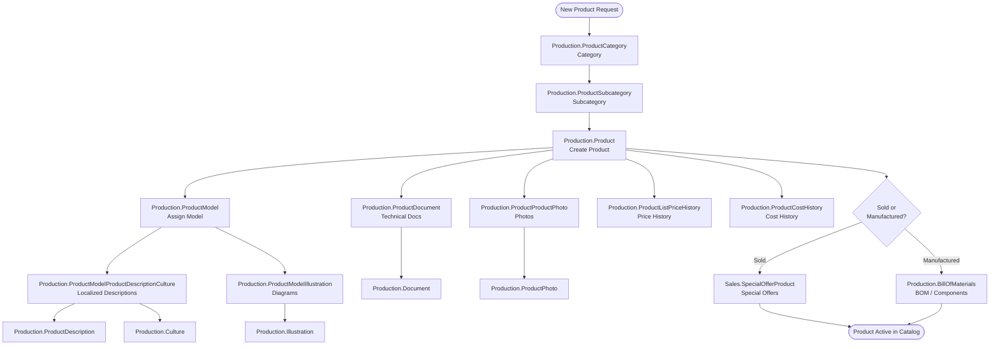
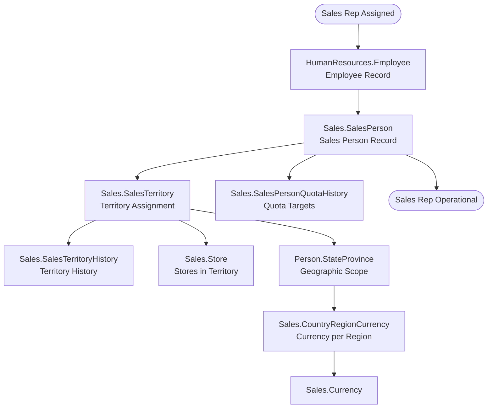
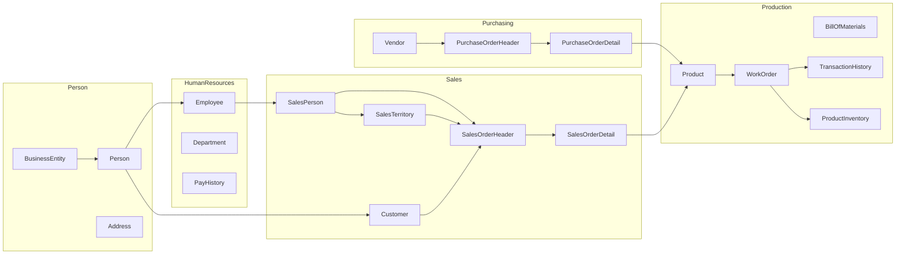

# AdventureWorks 2022 — Major Transaction Process Diagrams

Diagrams are derived from the AdventureWorks2022 database schema. Each diagram represents a major business transaction domain using the actual tables and foreign-key relationships.

---

## 1. Sales Order Process

A customer places an order through a sales person, optionally with a credit card and currency conversion, resulting in line items fulfilled from product inventory.

---

## 2. Purchase Order Process

A buyer employee creates a purchase order against a vendor for specific products, with line items tracking received quantities and costs.

---

## 3. Manufacturing / Work Order Process

A work order drives the manufacturing of a product through routed operations at production locations, consuming components from the bill of materials.

---

## 4. Employee Onboarding Process

A job candidate is hired, creating a person and employee record, then assigned to a department and shift with pay history tracked over time.

---

## 5. Customer / Person Registration Process

A new customer is registered, linked to contact details and an optional credit card, and associated with either a store account or an individual consumer profile.

---

## 6. Product Catalog Management Process

A new product is defined under a category hierarchy, associated with a model and descriptions in multiple cultures, priced, and made available for sale or manufacture.

---

## 7. Sales Person & Territory Management

Sales people are assigned to territories with quota histories tracked over time, and stores are linked to territories for reporting.

---

## Schema Domain Overview

